# 🏎️ Project Vegas Surveillance


> **"Mission Control" interface for real-time monitoring of the Las Vegas F1 Circuit using OSINT data and Reverse Engineering.**

---

## 📡 Live System Demo


---

## 🎯 The Story (CSI vs. Reality)

Inspired by a scene in *CSI: Las Vegas* where investigators freely access traffic cameras, I asked myself: *"Is it technically possible to watch the F1 Grand Prix using only public infrastructure?"*

The answer is **Yes**, but it required bypassing significant security layers. This project is the result of that weekend engineering challenge.

---

## ⚙️ Engineering Architecture

This isn't just a video player. It's a complex system designed to bypass **Geo-blocking** and **TLS Fingerprinting** used by government servers.

### The Challenge

The Nevada Department of Transportation (NDOT) servers block:
1. **Non-US IP Addresses** (Geo-restriction)
2. **Automated Scripts** (TLS JA3 Fingerprinting)
3. **Cross-Origin Requests** (CORS)

### The Solution (How it works)

```mermaid
graph LR
    A[User/React Frontend] -->|Request Feed| B(Python FastAPI Proxy)
    B -->|Impersonates Chrome 120| C{VPN Tunnel 🇺🇸}
    C -->|Legitimate Request| D[Nevada Gov Servers]
    D -->|HLS Stream| C
    C -->|Stream Data| B
    B -->|Bypasses CORS| A
```



**Backend Proxy**: A custom Python service intercepts frontend requests.

**Impersonation**: Uses `curl_cffi` to mimic the exact TLS Handshake of a Chrome browser, fooling the server's anti-bot protection.

**Tunneling**: Relies on a system-level VPN tunnel to exit via a US residential node.

**Demand Control**: Frontend implements a "Power Button" logic to only consume bandwidth when specifically requested.

---

## ✨ Features

- 🎨 **Cyberpunk UI**: A "Dark Mode" aesthetic inspired by F1 telemetry screens
- 📹 **Real-Time HLS**: Native handling of `.m3u8` streams using video.js
- 🔌 **Infrastructure Optimization**: "Connect Feed" buttons prevent bandwidth saturation on free VPN tiers
- 🔄 **Resilience**: Auto-reconnect logic and "Signal Lost" handling
- 📱 **Responsive**: Adapts from 1-column mobile view to a cinematic 2-column desktop view
- 🛡️ **Security Bypass**: Advanced TLS fingerprinting and geo-restriction circumvention

---

## 🛠️ Tech Stack

### Backend (The Brain)

| Technology | Purpose |
|------------|---------|
| **Python 3.10+** | Core language |
| **FastAPI** | High-performance async API |
| **curl_cffi** | Advanced HTTP client for TLS fingerprint spoofing |
| **Uvicorn** | ASGI Server |

### Frontend (The Face)

| Technology | Purpose |
|------------|---------|
| **React 18** | UI Framework |
| **Vite** | Lightning fast build tool |
| **TailwindCSS** | Custom utility classes for the "Mission Control" look |
| **Video.js** | Robust HLS streaming engine |
| **Lucide React** | Vector iconography |

---

## 🚀 Quick Start

### Prerequisites

- ✅ **VPN Required**: You MUST be connected to a US Server (ProtonVPN or similar) for the streams to load
- ✅ Python 3.10+ installed
- ✅ Node.js 18+ and npm installed
- ✅ Git installed

### 1. Clone the Repository

```bash
git clone https://github.com/limagabri/project-vegas-surveillance.git
cd project-vegas-surveillance
```

### 2. Backend Setup

```bash
cd backend

# Create virtual environment
python -m venv venv

# Activate virtual environment
# Windows:
.\venv\Scripts\activate
# Mac/Linux:
source venv/bin/activate

# Install dependencies
pip install -r requirements.txt

# Run the server
uvicorn app.main:app --reload
```

The backend will start on `http://localhost:8000`

### 3. Frontend Setup

Open a new terminal window:

```bash
cd frontend

# Install dependencies
npm install

# Start development server
npm run dev
```

The frontend will start on `http://localhost:5173`

### 4. Access the Application

1. Open your browser and navigate to `http://localhost:5173`
2. Ensure your VPN is connected to a US server
3. Click "CONNECT FEED" on any camera to start streaming

---

## 📍 Camera Intel

The system monitors key strategic points of the Las Vegas Strip Circuit:

| Camera | Location | Strategic Value |
|--------|----------|----------------|
| **CAM-01** | Flamingo Rd Straight | High speed zone |
| **CAM-02** | The Sphere (T5-9) | Technical section complex |
| **CAM-03** | The Strip (Bellagio) | Iconic backdrop |
| **CAM-04** | Caesars Palace | Chicane entry |
| **CAM-05** | Turn 13 | Heavy braking zone |

---

## 🔧 Configuration

### Environment Variables

Create a `.env` file in the `backend` directory:

```env
# API Settings
API_HOST=0.0.0.0
API_PORT=8000
DEBUG=True

# CORS Settings
CORS_ORIGINS=["http://localhost:5173"]

# Stream Settings
STREAM_TIMEOUT=30
MAX_RETRIES=3
```

### VPN Configuration

Recommended VPN settings:
- **Location**: United States (preferably West Coast)
- **Protocol**: WireGuard or OpenVPN
- **Kill Switch**: Enabled
- **DNS Leak Protection**: Enabled

---

## 🧪 Testing

### Backend Tests

```bash
cd backend
pytest tests/ -v
```

### Frontend Tests

```bash
cd frontend
npm run test
```

---

## 📊 Performance Metrics

- **Average Latency**: ~2-3 seconds behind live feed
- **Stream Quality**: 720p @ 30fps (dependent on NDOT source)
- **Bandwidth Usage**: ~2-3 Mbps per active stream
- **Concurrent Streams**: Up to 6 cameras simultaneously

---

## 🔮 Roadmap (GP 2026)

* [ ] **Signal Enhancement:** Implement AI Super-Resolution (Real-ESRGAN) to upscale grainy low-light footage.
* [ ] **Computer Vision:** Train a custom YOLOv8 model optimized for night-time vehicle detection on The Strip.
* [ ] **Telemetry Overlay:** Simulated overlay based on live timing API combined with visual tracking.

---

## 🐛 Troubleshooting

### Stream Won't Load

1. **Verify VPN Connection**: Ensure you're connected to a US server
   ```bash
   curl https://ipinfo.io/country
   # Should return: US
   ```

2. **Check Backend Logs**: Look for TLS handshake errors
   ```bash
   tail -f backend/logs/app.log
   ```

3. **Clear Browser Cache**: Hard refresh with `Ctrl+Shift+R` (Windows) or `Cmd+Shift+R` (Mac)

### CORS Errors

Update `backend/app/main.py`:
```python
app.add_middleware(
    CORSMiddleware,
    allow_origins=["http://localhost:5173"],  # Add your frontend URL
    allow_credentials=True,
    allow_methods=["*"],
    allow_headers=["*"],
)
```

### Performance Issues

- Reduce number of active streams
- Lower video quality in `frontend/src/config/cameras.js`
- Check CPU usage (video.js can be intensive)

---

## 🤝 Contributing

Contributions are welcome! Please follow these steps:

1. Fork the repository
2. Create a feature branch (`git checkout -b feature/AmazingFeature`)
3. Commit your changes (`git commit -m 'Add some AmazingFeature'`)
4. Push to the branch (`git push origin feature/AmazingFeature`)
5. Open a Pull Request

---

## 📄 License

This project is licensed under the MIT License - see the [LICENSE](LICENSE) file for details.

---

## ⚠️ Legal Disclaimer

**EDUCATIONAL PURPOSE ONLY**

This project utilizes **OSINT (Open Source Intelligence)** data publicly available via Nevada Department of Transportation. It is a **Proof of Concept** demonstrating:
- Network engineering techniques
- Frontend development skills
- TLS fingerprinting research

**Important Notes:**
- Not affiliated with Formula 1®, Liberty Media, or FIA
- Not intended for commercial use
- Streams are property of Nevada DOT
- Use responsibly and in compliance with local laws
- VPN usage must comply with provider's Terms of Service

---

## 👤 Author

**Developed with 🏎️ & ☕ by Gabriel Lima**  

[](https://github.com/limagabri)  
[](https://www.linkedin.com/in/souzalimagabriel)  

---

## 🙏 Acknowledgments

- Nevada Department of Transportation for public camera infrastructure
- The curl_cffi team for advanced HTTP client capabilities
- Video.js community for excellent HLS support
- F1 community for inspiring technical challenges

---

## 📞 Support

If you encounter issues or have questions:

1. Check the [Troubleshooting](#-troubleshooting) section
2. Search [existing issues](https://github.com/limagabri/project-vegas-surveillance/issues)
3. Open a [new issue](https://github.com/limagabri/project-vegas-surveillance/issues/new) with:
   - Detailed description
   - Steps to reproduce
   - System information (OS, Python/Node versions)
   - Logs from backend and browser console

---

## ⭐ Show Your Support

If this project helped you or you found it interesting, please give it a ⭐️!   
Built with ❤️ for F1 and technology enthusiasts!

---


